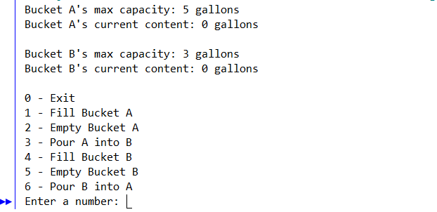

# Water-Jug-Challenge
Water Jug Challenge riddle game from the Movie: "Die Hard with a Vengeance"  (https://www.youtube.com/watch?v=BVtQNK_ZUJg)

Can you solve the water juggle riddle? If you have a 5 Gallon tank and 3 Gallon tank with unlimited water supply, can you fill exactly 4 Gallons of water in one of the two tank? Download and play the game to see if you can solve it.

Open this file with Jgrasp or Visual Studio. Make sure to have the C++ complier setup. 
Here instruction how to install C++ and the compiler : https://w3.cs.jmu.edu/bernstdh/web/common/help/cpp_mingw-setup.php

  

